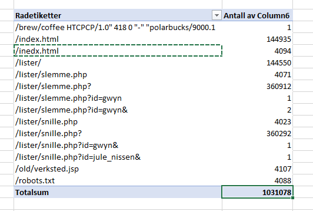
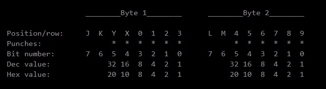

Dette var en CTF arrangert av [PST](http://pst.no) som en julekalender for 2019. Kjempegøy å delta med mange varierende og utfordrende oppgaver. Jeg lærte masse nytt og kunne en del fra før av. Oppgavene utviklet seg i vanskelighetsgrad og de 2 siste lukene var nok godt over mitt nivå.

# Luke 1

##### Velkommen til NPST

I [oppgaveteksten](https://link/) får vi oppgitt at man skal logge inn på https://login.npst.no med brukernavn **bruker** og passord **Advent2019** som gir oss første flagg som er **PST{a7966bf58e23583c9a5a4059383ff850}**

##### Velg Passord

På websiden får vi beskjed om å sette nytt passord, men at den må være på formen:

[a-z][a-z][0-9][*@!#%&amp;()^~{}]

Samtidig får vi melding om at passordkarakterene må være i stigende ascii-verdi samt at summen av ASCII-verdier modulo 128 må være lik 24.

På dette stadiet lukter det fort at man må lage et enkelt script som genererer passord. Jeg lagde et noe overkomplisert script i Python som lager passord og lagrer de til ei liste. Etter scriptet er kjørt kan man åpne passordlisten som har blitt generert og lime inn hvilket som helst av passordene og man får da flagget **PST{6a0f0731d84afa4082031e3a72354991}**

##### Passordgjenoppretting

Nå får vi følgende oppgavetekst:

> En tidligere ansatt måtte slutte etter å ha endt opp på listen over slemme barn. Dessverre glemte vi å be han kopiere ut filene sine før han sluttet, og vi har følgelig ikke passordet.

> Dette er det vi har av info:

> Brukernavn: **admin**

> ???: **42f82ae6e57626768c5f525f03085decfdc5c6fe**

> Klarer du å logge inn på kontoen?

Her finnes det 2 mulige veier til målet slik jeg fant ut. Man kan gå til http://hashes.org eller lignende sider for å søke på denne sha1-hashen. Der skal man få treff, og det var denne metoden jeg benyttet meg av. Men jeg laget samtidig et [script](http://wwww/) som sjekker sha1-hashen mot alle passordene jeg genererte på forrige oppgave.Man kommer da fram til at passordet som matcher sha1-hashen er **)9Fp**.

Man logger da inn på http://login.npst.no med **admin**/**)9Fp** og får flagget **PST{36044221cd3e991ffc56eb2f1e368ca0}**

# Luke 3

##### PPK

I oppgaveteksten får vi presentert et cipher som ser slik ut: **KNO fmwggkymyioån 30å6ø8432æå54710a9æ09a305å7z9829 fmwggkymyioån ngpoo**

Oppgaveteksten nevnte Enigma og jeg leste ikke oppgaveteksten nøye nok og var helt klar på at dette måtte være Enigma som skulle dekodes. Etter noen timer med Enigma analyserte jeg cipheret en gang til og fant ut at **fmwggkymyioån** går igjen 2 ganger og da kan det ikke være Enigmakode.

Etterhvert finner jeg ut at det dreier seg om et ceasar shift cipher som jeg løser via https://cryptii.com/pipes/caesar-cipher

Jeg shifter indexen 24 ganger og får resultatet **PST krøllparantes 30e6d8432ce54710f9c09f305e7b9829 krøllparantes slutt** som gir flagget **PST{30e6d8432ce54710f9c09f305e7b9829}**

## Luke 5

##### 🐒i

I oppgaveteksten får vi oppgitt en url til et API som angivelig er skrevet i node.js. Siten vi skal besøke er https://npst.no/api/🙃.js og der får vi oppgitt følgende:

> {"error":false,"state":"[>🍕<, 🍉, 🐴, 🐟, 🚀, 🚩]","message":"Bruk /api/🙃.js?commands=🤷 for en 📃 over 👌 ,n🚽er."}

Når man prøver å kjøre ?commands=🤷 returneres dette:

> {"error":false,"state":"[>🍕<, 🍉, 🐴, 🐟, 🚀, 🚩]","message":"Tilgjengelig ,n🚽er: ✨, ⚡, 🔑, 🤷. Eksempel: /api/🙃.js?commands=✨⚡✨"}

Dette betyr at man skal poste en eller annen kombinasjon med ✨, ⚡, 🔑,

Jeg prøvde å gjøre denne oppgaven manuelt men klarte ikke å skjønne logikken bak, så da måtte man ty til bruteforce.

Jeg skrev et overkomplisert [script](http://web) som gjetter payloaden. Det vanskeligste var å konvertere emojiene til noe fungerende å poste med da disse måtte konverteres til tekst.

**%E2%9C%A8** = ✨

**%E2%9A%A1** = ⚡

**%F0%9F%94%91** = 🔑

Det kom fram enda en begrensning på at det kunne vær kun max 20 emojis som kunne postes samtidig, ellers så hadde jeg ingen peiling på om det var et gitt antall emojis som krevdes.

Jeg lagret alle kallene som ikke fungerte til fil også, slik at jeg kunne holde kontroll på hvilke kall jeg hadde prøvd tidligere, slik at jeg ikke forsøkte det samme kallet 2 ganger.

Metoden fungerte etter en del tusen kall til serveren. Fant også flere kall som henter flagget, men tenkte ikke så mye mer på logikken bak. Et av kallene som fungerte var dette: https://npst.no/api/%F0%9F%99%83.js?commands=%E2%9A%A1%E2%9A%A1%E2%9C%A8%E2%9A%A1%E2%9C%A8%E2%9A%A1%E2%9C%A8%F0%9F%94%91%E2%9A%A1 som gir flagget **PST{ba323c3f5b3f1b536461d41cc7f1ba60}**

# Luke 6

##### PPKv2

Oppgaveteksten sier følgende:

> NI553N h4r få77 på p1455 ny PPK. K4n ni553n3 hj31p3r3 v3rifi53r3 4t k0d3n 3r ukn3kk31ig?

> KNO fmw55k8m7i179 z98øyåz8æy67aåy0å6æ7aø1å1438åa5a fmw55k8m7i179 95p11

Her er mye av den samme kodinga som på PPK, men når man har shifta en gang står man igjen med PST krø55p8r7n179 b98daeb8ca67fea0e6c7fd1e1438ef5f krø55p8r7n179 95u11

Her slet jeg lenge med å forstå logikken, da jeg replacet karakterene slik at ting skulle være forståelig. Uheldigvis skulle man shifte en gang til med ceasar cipher, denne gangen med tall fra 0-9. Jeg brukte onlineverktøyet https://cryptii.com/pipes/caesar-cipher og kom fram til teksten PST krø11p4r3n735 b54daeb4ca23fea6e2c3fd7e7094ef1f krø11p4r3n735 51u77

Flagget ble da **PST{b54daeb4ca23fea6e2c3fd7e7094ef1f}**

# Luke 7

##### Nissens Verksted

Oppgaveteksten forteller at det er noe digitalisering på gang i nisseverkstedet og at de har mistet et flagg inne der. Urlen er https://verksted.npst.no/

Her er det 12000 png`er som alle er forkledd som md5hasher. Denne oppgaven satte meg helt ut. Forsøkte en del rare ting her og en av de var å prøve alle 12k hashene på online hash-søk. Ingen ga noe treff noe sted jeg kunne finne, så ingenting som skillte seg ut ved første øyekast.

Jeg ble etterhvert så desperat at jeg lastet ned(med et [python-script](http://url)) samtlige png`er til lokal pc og kjørte et [python-script](http://url) mot filene jeg lastet ned og sjekket filstørrelsen på disse for å finne ugjevnheter. 2 flagg skilte seg ut:

\*\*8798e1f0a271b09750a6531686fc621b.png

b30b4add25b97721ebf0e7ad2eb26eb9.png\*\*

**PST{8798e1f0a271b09750a6531686fc621b}** var flagget på denne oppgaven.


##### Bedriftsspionasje

Her var det ganske opplagt at det var det andre bildet jeg hadde funnet var den andre løsningen.

**PST{b30b4add25b97721ebf0e7ad2eb26eb9}**


# Luke 8

##### 8. desember

I [oppgaveteksten](http://url) får man høre om en joggetur til Julenissen og rudolf. Rudolf har vissnok tatt en liten omvei, og man blir bedt om å finne ut hvor dette var. Oppgaven viser også et [bilde](http://strava.png) av julenissen og rudolf, der julenissen holder en mobil med strava aktiv.

Vi finner lett julenissen på strava og aktivtetene til rudolf og nissen:

https://www.strava.com/activities/2910401436

https://www.strava.com/activities/2910407508

Jeg så bygningen Rudolf hadde vært innom og google maps sier at dette er NORTH POLE EXPEDITION MUSEUM som også er svaret for oppgaven.

**PST{NORTH POLE EXPEDITION MUSEUM}**

##### Spionaktivitet

Oppaveteksten:

> Det har kommet tips om mulig spionaktivitet utført av sørpolare agenter på Svalbard i tidsrommet Nissen og Rudolf var på løpetur. Kan du identifisere en agent?

Jeg bruker strava flittig selv og vet godt om flybys-funksjonen og finner Pen Gwyn sin aktivitet her: https://www.strava.com/activities/2910413144

På strava-profilen til Pen Gwyn finner vi neste flagg:

**PST{69d26031ea5dbbeb56f22d9647f7c98e}**

##### Mystiske profiler

Oppgavetekst:

> Våre analytikere mistenker at Pen Gwyn har rapportert hjem til sine kontakter på sydpolen. Klarer du å dekode noe av kommunikasjonen?

Pen Gwyn har en aktivitet som heter rapport som inneholder et bilde


Et minutt eller to med manuell kryptoanalyse ser jeg at dette er morsekode. Det vanskeligste her var egentlig å dekode bildet til morse manuelt. Morsekoden ble:

> .--. ... - -.- .-. --- .-.. .-.. .--. .- .-. . -. - . ... . ----- -.... ..... ...-- .---- -.. .---- ----. ..-. ..-. ----- ..--- ----- .- ....- --... ----. ..... ..--- ----- . ..-. ..--- ---.. -.-. ---.. -.. .---- . ..--- -.-. -.- .-. --- .-.. .-.. .--. .- .-. . -. - . ... ... .-.. ..- - -

Som resulterte til følgende tekst, via denne [verktøysiden](https://www.kalkuler.com/kalkulator/tekst/morsekode/)

PST KROLLPARENTES E06531D19FF020A479520EF28C8D1E2C KROLLPARENTES SLUTT

Flagget var **PST{e06531d19ff020a479520ef28c8d1e2c}**

# Luke 10

##### Vige vs. Nere

Her får vi i oppgaveteksten en sjakk PGP-kode der det skal gjemme seg et hemmelig cipher. Jeg har ikke vært borti sjakk-cipher før og ble lett forvirret. Prøvde en del kombinasjoner med å se på ulike tall og hex-kombinasjoner. Googlet meg fram til at det er noe som heter chess stego og fant denne dekodingssiden: https://incoherency.co.uk/chess-steg/

Legger man inn PGP-dataene inn i denne og dekoder finner man at denne teksten skjuler seg inne i sjakkspillet: HHL DJDWEDESKWCLXK u02s104y2s665t5v3w2619v6184su50t CGGXDAHTJTFMWH KEMIL

Dette ser ut som et cipher og ettersom oppgaven heter Vige vs Nere, så er det ganske opplagt at man skal dekode med en viegnere-funksjon. Jeg brukte dette online-verktøyet der man kan bruteforce om man kjenner deler av plainteksten https://www.dcode.fr/vigenere-cipher Plainteksten jeg sjekket mot var PST.

Her dekodes cipheret til PST KROELLPARENTES f02a104f2a665e5d3d2619d6184dc50a KROELLPARENTES SLUTT og nøkkelen for cipheret er SPST.

Flagget blir **SPST{f02a104f2a665e5d3d2619d6184dc50a}**

# Luke 12

###### Arbitrær kode

Oppgaveteksten ga en url som var https://api.spst.no/eval?eval=`<pre>\${getFlag()}</pre>` og instruksjoner om å finne et flagg. Her var jeg usikker på hvordan jeg skulle starte å lete, da dette så ut som whatever for min del. Jeg bestemte for å benytte wfuzz/gobuster for å sjekke om jeg kunne finne forskjellige sites.

Jeg fant at man kunne printe flere forskjellige javascriptfunksjoner som skulle gjøre en dekrypting av en hash. Jeg samlet de fleste funksjonene jeg fant i [functions.js](http://url). Prøvde å sette det opp på lokal for å console.logge underveis men manglet en del funksjoner. Fant til slutt ut at jeg hadde de parametrene jeg stort sett trengte, manglet bare passordet som kunne enkelt brutforces med følgende [python-script](http://url):

```

import requests

url = '''https://api.spst.no/eval?eval=decrypt(%22passord-'''

url2 = '''1%22,%22NaHSO4%22,%22e5a8aadb885cd0db6c98140745daa3acf2d06edc17b08f1aff6daaca93017db9dc8d7ce7579214a92ca103129d0efcdd%22)'''

for x in range(0, 100):

r = requests.get(url=url+str(x)+url2)

print(r.text, x)

```

Dette gjorde at jeg fant ut at passordet skulle være **passord-61** og lenka til et fungerende dekryptering av hash var https://api.spst.no/eval?eval=decrypt(%22passord-61%22,%22NaHSO4%22,%22e5a8aadb885cd0db6c98140745daa3acf2d06edc17b08f1aff6daaca93017db9dc8d7ce7579214a92ca103129d0efcdd%22)

Flagget var **PST{24e592de8b20fe09938916d79b08854e}**

# Luke 13

##### Token effort

Her får vi 4 passordpakkede filer som viser seg å være en zip-fil med flere pakkede filer inni seg. Oppgaveteksten sier at passordet for filen befinner seg i [jobbannonsen](https://www.finn.no/job/fulltime/ad.html?finnkode=165416216) som har blitt lagt ut av PST. Jeg laget et [pythonscript](http://url) som deler opp alle setningene og til ord for å danne en passordliste. For å ta knekken på passordet skrev jeg et [python-script](http://url) som prøver alle passordene i listen jeg laget.

Klassisk [Matrjosjka](https://no.wikipedia.org/wiki/Matrjosjka) inne i den passordbeskyttede pakken. 4Jeg hadde ikke noen verktøy for dette for hånden, så jeg pakket ut alle filene manuelt. Etter dette står vi igjen med 4 filer:

```

2019-12-07.access.log

2019-12-08.access.log

2019-12-09.access.log

2019-12-10.access.log

```

I disse filene gjemmer deg seg masse POST, GET og DELETE-requests i log-format. Jeg formaterte filene til csv-vennlig format og importerte dataene inn til excel. Laget en pivot-tabell og sjekket hvilke kall som skilte seg ut:


Her var det en som skilte seg ut nok til å kunne prøves som flagg **_snille.php?id=jule_nissen&_**

Flagget var **_PST{67e49727affdee991ec58180ee657b28}_**

# Luke 14

###### Lekket data

I [oppgaveteksten](14/Oppgavetekst.txt) kom det fram at man skulle knekke et cipher med markeringen U+2295/U+22BB som er ekvivalent til XOR. Problemet med cipheret var at man ikke vet hvilket ord man skal XOR`e med.

Jeg kom etter hvert over et tool som heter [xortool](https://github.com/hellman/xortool) som man kan kjøre mot cipherteksten for å finne secretkeyen som er blitt brukt.

```
The most probable key lengths:
   1:   10.6%
   5:   9.6%
   9:   8.8%
  11:   24.4%
  18:   5.8%
  22:   14.4%
  25:   4.6%
  33:   9.7%
  44:   6.9%
  55:   5.4%
Key-length can be 3*n
Key-length can be 4*n
1 possible key(s) of length 11:
'Ju)enEr\x11eit
```

Ikke helt perfekt, men perfekt nok til å tippe at key`en er **_JulenErTeit_**

Jeg hadde tidligere laget meg en liste over mulige XOR-keys som jeg la i en liste. Nå kunne jeg legge JulenErTeit i samme [liste](14/keys.txt) og kjøre [XOR-scriptet](14/hack.py) mitt på nytt.

Ut kom flagget **_PST{a392960421913165197845f34bf5d1a8}_**

# Luke 15

###### 15. desember

Her fikk vi en tar.gz-fil som var et NTFS-filsystem. Jeg brukte først binwalk på å pakke ut dataene på, big fail. Jeg mistet mye data på dette og ting la seg feil. Prøvde så med [7zip](https://www.7-zip.org/) som er kanskje det beste programmet jeg vet om for visuell utpakking av filer. Når jeg så filsystemet som jeg pakket ut, tok det ikke lang tid til jeg begynte å se på Alternative Data Streams. Jeg har vært bort på denne type problemstilling i CTF tidligere og jeg får fram disse også med 7zip. Jeg fant en fil som het "\_" i filen **_feriebilder.zip_**

I denne filen fant jeg en base64-streng som dekoda til:
**_Et kjempelangt passord som aldri vil kunne gjettes av NPST! :)_** som også var flagget. for denne oppgaven. Det var også passordet for zip-fila som man umulig kunne ha bruteforcet.

##### Alternativer

I neste oppgave fikk man spørsmål om hvor man fant det forrige flagget som også skulle være ett tegn. Man skulle også md5summe resultatet. Dette var relativt banalt og ukomplisert spørsmål, da den alternative strømmen fra forrige oppgave hadde en fil som bare het "_" så var dette ezpz.
echo -n "_" | md5sum => **_PST{b14a7b8059d9c055954c92674ce60032}_**

##### Feriebilder

Nå til neste oppgave

> Bildene ser jo ut til å være helt normale sydpolare feriebilder, men vi vet jo at sydpolare spioner liker å gjemme data inni andre ting. Kan du hente ut et flagg fra ett av bildene?

Denne oppgaveteksten gjorde at man tenkte på stego med en gang. Men det skulle ikke være så enkelt. I ett av alpha-kanalene i bildet så var det gjemt en tekst PST{md5sum(red_herring)} der red herring er et annet ord for decoy eller blindvei, så oppgaven var ikke så innlysende som man skulle tro.

Her var jeg på vei til å gi opp, men prøvde å se på forskjeller i de forskjellige bildene i feriebilder.zip med en binwalk \* i mappen. Denne funksjonen lister md5summene til de ulike filene. Jeg bare forsøkte helt random med de 2 første og på andre forsøk fikk jeg "Correct"!!!!

md5checksummen på **_måltid.png_** var altså flagget her:
**_PST{07385aacc9264738cd7c32e76f3b81a5}_**

# Luke 17

##### Passorddatabase

I denne oppgaven fikk vi en ELF-fil som skulle være en passordbase som noen har glemt passordet til. Jeg prøvde meg fram i GDB og i Ida64 men jeg så bare masse funksjoner som kjørte og bytting av minneallokeringer og flytting av variabler. Prøvde en del variasjoner i GDB for å se om det kom noe magisk opp i terminalen, men no go.

Rev er ikke min sterkeste side, så jeg husket John Hammond har skrevet en fin [oversikt](https://github.com/JohnHammond/ctf-katana) over hvilke tools man kan benytte til enkelte CTF-oppgaver. Her fant jeg verktøyet **_ltrace_** som hjalp meg ekstremt mye.
Vanlig kjøring av programmet:

```
% ./p2w
Passord:
Feil, pigg av!
```

Ved bruk av ltrace:

```
% ltrace ./p2w
printf("Passord: ")                      = 9
fgets(Passord:
"\n", 33, 0x7fcb8fbeba00)                = 0x7fffca7b0000
strcmp("\n", "625b2055fe2dcda72e418940599b881d"...)  = -44
puts("Feil, pigg av!"Feil, pigg av!
)                                        = 15
+++ exited (status 0) +++
```

Her er det lett å se at passordet som programmet egentlig skal ha, er **_625b2055fe2dcda72e418940599b881d_**

Putter man inn dette i programmet, får man til bake et flagg:
**_PST{f3ad88918fd18414cc773271f586_**

# Luke 19

##### PPKv3

Nytt cipher, denne gangen:
**_ømQ UæjEEi4æÅktÅr i4æÅktÅr SZG tWM tPSÅ i4Z i4æÅktÅr rE0tt UæjEEi4æÅktÅr rE0tt_**

Vi vet mye om dette formatet cipher nå. Det skal starte på **PST**, neste ord er mest trolig **krøllparantes**, det skal være enda et **krøllparantes** og det hele skal avsluttes med et **slutt**

Med denne innsikten kan man erstatte bokstavene man ikke kjenner, til man står igjen med 3 ukjente bokstaver som man båre må gjette til seg.

ømQ UæjEEi4æÅktÅr i4æÅktÅr SZG tWM tPSÅ i4Z i4æÅktÅr rE0tt UæjEEi4æÅktÅr rE0tt
PST krøllparentes parentes md5 two time pad parentes slutt krøllparentes slutt

echo -n "two time pad" | md5sum => **_PST{4a0fc5f3c88874cab11c64e965dff58d}_**

# Luke 20

##### Mystisk kort

I denne oppgaven får vi servert et cipher som er stykket opp i lengder på 4 siffer/tall og har ut ifra oppgaveteksten noe med hullkort og 360 å gjøre.

> 1020 2020 0010 2012 2001 2200 1020 0000 0800 0200 0001 200A 2001 2200 1020 0C00 0300 0008 0800 1012

Vi skal derfor dekode et 360 hullkort [https://no.wikipedia.org/wiki/IBM_System/360](https://no.wikipedia.org/wiki/IBM_System/360). I denne oppgaven sliter jeg virkelig med å forstå hva jeg skal gjøre for å dekode dataene jeg har fått. Jeg vet hvilket cipher dette er men finner ingen enkel måte eller tools til å dekode disse dataene på.

Etter mye om og men finner jeg en beskrivelse på [stackoverflow](https://stackoverflow.com/questions/52612738/decode-hexadecimal-number-in-ibm-360-column-binary-format), sammen med en [side](https://www.masswerk.at/keypunch/) som kan dekode og forklarer hvordan man regner om disse tallene man har fått:

Jeg finner fram til denne dekodinga og til bokstaver at man skal fram til md5summen av teksten **IBM 029+IBM/360**

Flagget er **_PST{2d0330aeddd7a66612b328b06324e3b9}_**

# Luke 21

###### Nytt kryptosystem

Denne [oppgaveteksten](21/Oppgavetekst.txt) gir oss et cipher der alt tyder i retning på at vi har med en AES 256-kryptert melding å gjøre. I [melding.json](21/melding.json) kommer det frem at 2 bits av noe er usikre verdier, feil eller skiftet plass. Det er lettest å tenke å tro at det er nøkkelen som har feile verdier, så jeg skrev et [pythonscript](21/hack.py) som genererer masses bitflipper på nøkkelen og prøver alle de mulige genererte kombinasjonene for å dekode meldingen.

Jeg måtte generere ca 400k nøkler før jeg fant den riktige og ut kom flagget:
**_PST{7e7343c9cbe6114f8fd312490816387d}_**

# Luke 22

###### 22. desember

I oppgaveteksten får man en lenke til https://spst.no der det skal være ett eller annet gjemt. I CTF så er det lurt å alltid sjekke [robots.txt](https://spst.no/robots.txt) og her gjemmer det seg en undermappe **/temmelig-hemmelig/**

Går man til denne siten finner man flagget **_PST{fc35fdc70d5fc69d269883a822c7a53e}_**

###### Kildekode

Neste oppgave går ut på følgende:

> Vi er veldig interessert i hva denne applikasjonen gjør. Hadde vi bare hatt tilgang til kildekoden...

Her finner vi en [githublenke ](https://github.com/SydpolarSikkerhetstjeneste/spst.no) i kildekoden på siden til [spst](https://spst.no/temmelig-hemmelig/). Denne githubrepoet har historikk som sier at passordet til siten en gang var **pingvinerbestingenprotest** men at kodinga til denne har blitt omgjort til morsekode. Vi omkoder passordet til morse:

> .--. .. -. --. ...- .. -. . .-. -... . ... - .. -. --. . -. .--. .-. --- - . ... -

Vi poste rså morsekoden inn i skjemaet i siden til [spst](https://spst.no/temmelig-hemmelig/) og får et bilde tilbake. Her ligger flagget gjemt i ALT-teksten til bildet som er **_PST{f2e0e89f59722af1f388529720b9db03}_**

##### nbsp;

Videre får vi denne oppgaven:

> Våre analytikere mener SPST kan ha skjult informasjon for hackere som deg.

Veldig kryptisk og ikke enkelt å forstå med det første. [Bildet](22/95728ce2159815f2e2a253c664b2493f.png) som man fikk fram på forrige oppgave kan dekodes med [online stego decoder](https://stylesuxx.github.io/steganography/) som gjør at man skimter et mønster i [klartekst](22/qr.txt). Etter litt formatering og stretching av koden får man ut følgende qr-kode:

Denne dekodes til **/8a2a8e12017977d9dbf0ed33e254e94e.txt** men når man navigerer til denne siden på spst.no så får man samme feilmeldingen som man ellers ville fått, men denne meldingen skiller seg litt ut fra den generiske feilmeldingen. Inspiserer man kildekoden her så ser man det ligger zwnj;-tegn og forskjellig i denne koden som er uvanlig.

Etter en hel masse googling finner jeg fram til at man kan dekode cipher med zero-width karakterer på denne [siden](https://330k.github.io/misc_tools/unicode_steganography.html).

txt filen kan dekodes her og danner flagget **_PST{67b8601a11e47a9ee3bf08ddfd0b79ba}_**

# Luke 23

#### Mystisk julekort

Denne oppgaven klarte jeg ikke å løse

#### Fragmentert samtale

Her var jeg ganske lost på en fil vi hadde mottatt. Dette var av en type pcap som betyr at man må importere dataene inn i et program som f.eks [wireshark ](https://www.wireshark.org/) og rydde opp en strømm for å konvertere den tilbake til noe kan settes sammen. I dette tilfellet var det en SIP-telefonstrøm. Etter mange misslykkede forsøk på å få dekodet denne strømmen, gjettet jeg på at md5summen måtte være av en finn-jobbannonseoverskrift som var til en av jobbene til PST da dette ble klart hintet til i [oppgaveteksten](23/Oppgavetekst.txt)

Jobben jeg fant som PST hadde utlyst var for en **Nettverksspesialist** så jeg md5summet dette ordet og fant flagget **_PST{0844d949169d24679a1f0438f89c69e3}_**

# Luke 24

#### 24. desember

Denne oppgaven klarte jeg ikke å løse.

Oppgaveteksten hinter til en operasjonssentral for spst. Denne fant jeg etter litt hjelp fra min bedre halvdel som kunne denne forkortelsen: https://ops.spst.no
Her fant jeg fort et cipher som så slik ut:

> SAXVC OIWPT GQOJZ OXEHI ZVCWU NCCOW FIKVP NOENT CETAU IKPCM ZLOYP BJHEC KPEXG RJWDO DJBBI HQDTG FFBQV LJAZC ZOFIC ZAIWJ QEVCL FXAVC PDUWT GBIGM SSWAO OXJHP PLKXH TGQAY COIQL ZSWIL HKMYR YMPZZ PTIEL PSRIP YVRKC DINBR WJZJP HHNXM HGYWN XXIGB UTTOX AEPKZ TUCMC MGFHC WHSAY KFVVS PDBFE KABAB PNBVR IZGTX PERJZ GDHQJ JDUYV FAOYV JWZOU WXXPR HVDLL BQTJI HULQP ACIXG NUPUS PCKHT LOKLN ZCLZO QVWSL HPBWD ATZES JEITM AJIFU SIVVF PHPEN UYHZK AWIZY MNQLH ZVKJJ EEYSZ LLUEM NZAFA OZXYL WBRPX JUKQG KIEXX CDYAT IHVJK HOMGI UVAOQ PBXRN HAAWG XOBAZ UILJB KYSBP IOBKH GYZBD IPQNG VSUTS YXOGY KEIKK TIKKQ RFVWQ NBCEK TIJLC CXRDB TUNXT SBKWR YDBR

Jeg kjente igjen ciphere som Enigma ganske fort og ettersom man hadde fått små drypp om enigma-cipher underveis, så var det opplagt at dette kom sist. Dette er sporene man har fått fra tidligere luker:

```
Luke 01: IV P S
Luke 08: VII T F
Luke 15: VII T W
Luke 22: CO NG RA TS
```

Satte sammen disse og decoded ciphere via [https://cryptii.com/pipes/enigma-machine](https://cryptii.com/pipes/enigma-machine)

Meldingen resulterte i:

> fivez erosi xnine sixse vensi xseve ntwoz erosi xones evens ixtwo oneze roafo urnin esixe sixse vensi xfive sixet wozer osixt wosix fsixb seven three seven fours ixone seven sixsi xbsix asixf ivesi xbsev enthr eetwo ezero afour csixf ivese venfo urtwo zeros ixnin etwoz erosi xeigh tsixf ivese venei ghttw ozero seven zeroc three afive twoze rosix sixct hreeb eight sixcs ixsev ensix fives ixesi xfour sixfi vetwo zeros event wosix fives ixsev ensix fives evene ightt hreea twoze rofiv ebfiv ecsix fours ixone twods ixsix fived seven bthre etwos evend fivec twoes event hrees evenz erose venth reese venfo urfiv ectwo esixe sixf

Som kan oversettes til hex:

> 50696767206176210a496e67656e20626f6b737461766b6a656b732e0a4c65742069206865782070c3a52066c3b86c67656e64652072656765783a205b5c64612d665d7b327d5c2e737073745c2e6e6f

Og som igjen kan oversettes til ascii-tekst:

> Pigg av!
> Ingen bokstavkjeks.
> Let i hex på følgende regex: [\da-f]{2}\.spst\.no

Fra her visste jeg at det dreide seg om subdomener på 2 bokstaver eller tall, men klarte ikke å knekke koden noe dypere enn dette...
